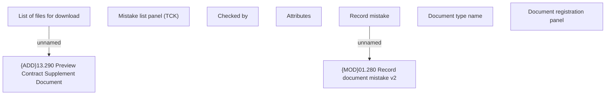

# Document registration panel - User interface model

```mermaid
graph TD
    List_of_files_for_download["List of files for download"]
    ADD_13_290_Preview_Contract_Supplement_Document["{ADD}13.290 Preview Contract Supplement Document"]
    Mistake_list_panel_TCK["Mistake list panel (TCK)"]
    MOD_01_280_Record_document_mistake_v2["{MOD}01.280 Record document mistake v2"]
    Checked_by["Checked by"]
    Attributes["Attributes"]
    Record_mistake["Record mistake"]
    Document_type_name["Document type name"]
    Document_registration_panel["Document registration panel"]
    Record_mistake -->|unnamed| MOD_01_280_Record_document_mistake_v2
    List_of_files_for_download -->|unnamed| ADD_13_290_Preview_Contract_Supplement_Document
```
