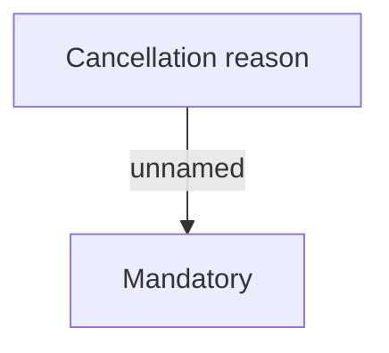

# Validation rules

- **Diagram Type**: Custom
- **Package**: HomerSelect/BSL/Analysis Model/Contract Supplements/COMMON for Supplements/Contract Supplement operations/Contract Supplement management/Validation rules
- **Diagram ID**: 162850
- **Elements**: 2
- **Connectors**: 1

