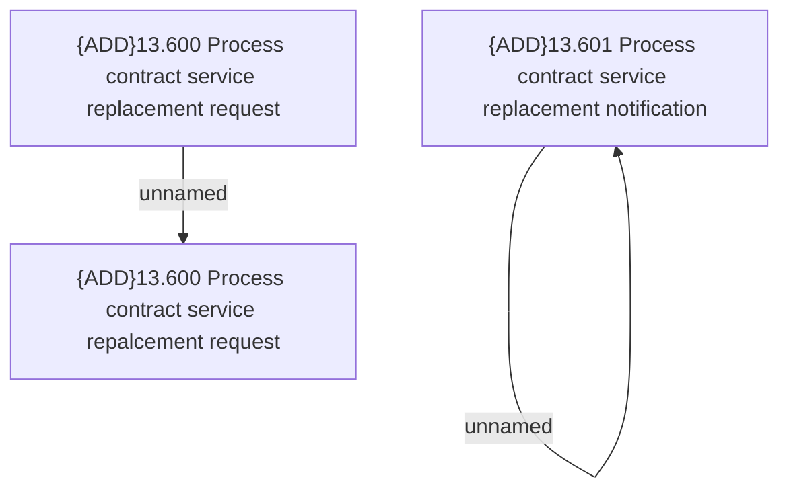

# Access Rights

- **Diagram Type**: Custom
- **Package**: HomerSelect/BSL/Analysis Model/Contract Supplements/Contract Service Support/Access Rights
- **Diagram ID**: 164696
- **Elements**: 4
- **Connectors**: 2

