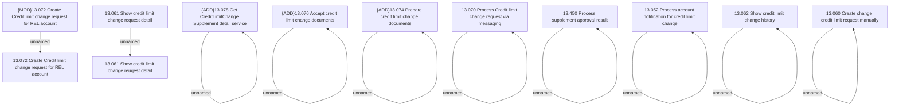

# Access Rights

```mermaid
graph TD
    ADD_13_078_Get_CreditLimitChange_Supplement_detail_service["{ADD}13.078 Get CreditLimitChange Supplement detail service"]
    ADD_13_078_Get_CreditLimitChange_Supplement_detail_service["{ADD}13.078 Get CreditLimitChange Supplement detail service"]
    ADD_13_076_Accept_credit_limit_change_documents["{ADD}13.076 Accept credit limit change documents"]
    ADD_13_074_Prepare_credit_limit_change_documents["{ADD}13.074 Prepare credit limit change documents"]
    ADD_13_076_Accept_credit_limit_change_documents["{ADD}13.076 Accept credit limit change documents"]
    ADD_13_074_Prepare_credit_limit_change_documents["{ADD}13.074 Prepare credit limit change documents"]
    n_13_072_Create_Credit_limit_change_request_for_REL_account["13.072 Create Credit limit change request for REL account"]
    n_13_070_Process_Credit_limit_change_request_via_messaging["13.070 Process Credit limit change request via messaging"]
    MOD_13_072_Create_Credit_limit_change_request_for_REL_accoun["{MOD}13.072 Create Credit limit change request for REL account"]
    n_13_070_Process_Credit_limit_change_request_via_messaging["13.070 Process Credit limit change request via messaging"]
    n_13_450_Process_supplement_approval_result["13.450 Process supplement approval result"]
    n_13_450_Process_supplement_approval_result["13.450 Process supplement approval result"]
    n_13_052_Process_account_notification_for_credit_limit_chang["13.052 Process account notification for credit limit change"]
    n_13_052_Process_account_notification_for_credit_limit_chang["13.052 Process account notification for credit limit change"]
    n_13_062_Show_credit_limit_change_history["13.062 Show credit limit change history"]
    n_13_062_Show_credit_limit_change_history["13.062 Show credit limit change history"]
    n_13_061_Show_credit_limit_change_request_detail["13.061 Show credit limit change request detail"]
    n_13_061_Show_credit_limit_change_reuqest_detail["13.061 Show credit limit change reuqest detail"]
    n_13_060_Create_change_credit_limit_request_manually["13.060 Create change credit limit request manually"]
    n_13_060_Create_change_credit_limit_request_manually["13.060 Create change credit limit request manually"]
    n_13_060_Create_change_credit_limit_request_manually -->|unnamed| n_13_060_Create_change_credit_limit_request_manually
    n_13_052_Process_account_notification_for_credit_limit_chang -->|unnamed| n_13_052_Process_account_notification_for_credit_limit_chang
    MOD_13_072_Create_Credit_limit_change_request_for_REL_accoun -->|unnamed| n_13_072_Create_Credit_limit_change_request_for_REL_account
    ADD_13_074_Prepare_credit_limit_change_documents -->|unnamed| ADD_13_074_Prepare_credit_limit_change_documents
    n_13_070_Process_Credit_limit_change_request_via_messaging -->|unnamed| n_13_070_Process_Credit_limit_change_request_via_messaging
    ADD_13_076_Accept_credit_limit_change_documents -->|unnamed| ADD_13_076_Accept_credit_limit_change_documents
    n_13_061_Show_credit_limit_change_request_detail -->|unnamed| n_13_061_Show_credit_limit_change_reuqest_detail
    n_13_062_Show_credit_limit_change_history -->|unnamed| n_13_062_Show_credit_limit_change_history
    ADD_13_078_Get_CreditLimitChange_Supplement_detail_service -->|unnamed| ADD_13_078_Get_CreditLimitChange_Supplement_detail_service
    n_13_450_Process_supplement_approval_result -->|unnamed| n_13_450_Process_supplement_approval_result
```
