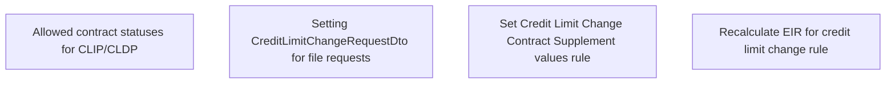

# Business Rules

```mermaid
graph TD
    Allowed_contract_statuses_for_CLIP_CLDP["Allowed contract statuses for CLIP/CLDP"]
    Setting_CreditLimitChangeRequestDto_for_file_requests["Setting CreditLimitChangeRequestDto for file requests"]
    Set_Credit_Limit_Change_Contract_Supplement_values_rule["Set Credit Limit Change Contract Supplement values rule"]
    Recalculate_EIR_for_credit_limit_change_rule["Recalculate EIR for credit limit change rule"]
```
