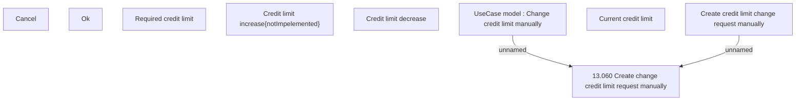

# Create credit limit change request manually - UI

```mermaid
graph TD
    Cancel["Cancel"]
    Ok["Ok"]
    Required_credit_limit["Required credit limit"]
    Credit_limit_increase_notImpelemented["Credit limit increase{notImpelemented}"]
    Credit_limit_decrease["Credit limit decrease"]
    UseCase_model_Change_credit_limit_manually["UseCase model : Change credit limit manually"]
    n_13_060_Create_change_credit_limit_request_manually["13.060 Create change credit limit request manually"]
    Current_credit_limit["Current credit limit"]
    Create_credit_limit_change_request_manually["Create credit limit change request manually"]
    UseCase_model_Change_credit_limit_manually -->|unnamed| n_13_060_Create_change_credit_limit_request_manually
    Create_credit_limit_change_request_manually -->|unnamed| n_13_060_Create_change_credit_limit_request_manually
```
