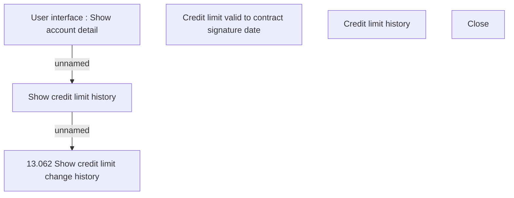

# Show credit limit change history - UI

```mermaid
graph TD
    User_interface_Show_account_detail["User interface : Show account detail"]
    n_13_062_Show_credit_limit_change_history["13.062 Show credit limit change history"]
    Credit_limit_valid_to_contract_signature_date["Credit limit valid to contract signature date"]
    Credit_limit_history["Credit limit history"]
    Close["Close"]
    Show_credit_limit_history["Show credit limit history"]
    User_interface_Show_account_detail -->|unnamed| Show_credit_limit_history
    Show_credit_limit_history -->|unnamed| n_13_062_Show_credit_limit_change_history
```
