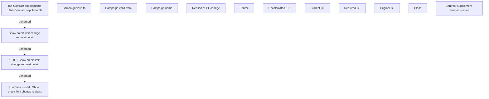

# Show credit limit change request detail - UI

```mermaid
graph TD
    Tab_Contract_supplements_Tab_Contract_supplements["Tab-Contract supplements : Tab-Contract supplements"]
    UseCase_model_Show_credit_limit_change_reuqest["UseCase model : Show credit limit change reuqest"]
    n_13_061_Show_credit_limit_change_request_detail["13.061 Show credit limit change request detail"]
    Campaign_valid_to["Campaign valid to"]
    Campaign_valid_from["Campaign valid from"]
    Campaign_name["Campaign name"]
    Reason_of_CL_change["Reason of CL change"]
    Source["Source"]
    Recalculated_EIR["Recalculated EIR"]
    Current_CL["Current CL"]
    Required_CL["Required CL"]
    Original_CL["Original CL"]
    Close["Close"]
    Contract_supplement_header_panel["Contract supplement header - panel"]
    Show_credit_limit_change_request_detail["Show credit limit change request detail"]
    Tab_Contract_supplements_Tab_Contract_supplements -->|unnamed| Show_credit_limit_change_request_detail
    Show_credit_limit_change_request_detail -->|unnamed| n_13_061_Show_credit_limit_change_request_detail
    n_13_061_Show_credit_limit_change_request_detail -->|unnamed| UseCase_model_Show_credit_limit_change_reuqest
```
