# Validation Rules

- **Diagram Type**: Custom
- **Package**: HomerSelect/BSL/Analysis Model/Contract Supplements/Credit limit change support/Validation Rules
- **Diagram ID**: 140822
- **Elements**: 10
- **Connectors**: 12

```mermaid
graph TD
    Requested_credit_limit_match_product_settings["Requested credit limit match product settings"]
    Required_credit_limit_is_rounded["Required credit limit is rounded"]
    Required_credit_limit_is_not_lower_then_suggestedAmount["Required credit limit is not lower then suggestedAmount"]
    Required_credit_limit_is_not_higher_then_suggestedAmount["Required credit limit is not higher then suggestedAmount"]
    Financial_amount_0["Financial amount ›= 0"]
    Mandatory["Mandatory"]
    Required_credit_limit_is_lower_then_current_credit_limit["Required credit limit is lower then current credit limit"]
    Required_credit_limit_for_CLIP["Required credit limit for CLIP"]
    Required_credit_limit_for_CLDP["Required credit limit for CLDP"]
    Required_credit_limit_is_higher_then_current_credit_limit["Required credit limit is higher then current credit limit"]
    Required_credit_limit_for_CLIP -->|unnamed| Required_credit_limit_is_higher_then_current_credit_limit
    Required_credit_limit_for_CLDP -->|unnamed| Required_credit_limit_is_lower_then_current_credit_limit
    Required_credit_limit_for_CLIP -->|unnamed| Mandatory
    Required_credit_limit_for_CLDP -->|unnamed| Mandatory
    Required_credit_limit_for_CLIP -->|unnamed| Financial_amount_0
    Required_credit_limit_for_CLDP -->|unnamed| Financial_amount_0
    Required_credit_limit_for_CLIP -->|unnamed| Required_credit_limit_is_not_higher_then_suggestedAmount
    Required_credit_limit_for_CLDP -->|unnamed| Required_credit_limit_is_not_lower_then_suggestedAmount
    Required_credit_limit_for_CLIP -->|unnamed| Required_credit_limit_is_rounded
    Required_credit_limit_for_CLDP -->|unnamed| Required_credit_limit_is_rounded
    Required_credit_limit_for_CLIP -->|unnamed| Requested_credit_limit_match_product_settings
    Required_credit_limit_for_CLDP -->|unnamed| Requested_credit_limit_match_product_settings
```

