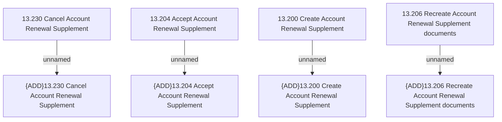

# Access Rights

- **Diagram Type**: Custom
- **Package**: HomerSelect/BSL/Analysis Model/Contract Supplements/REL Account renewal support/Access Rights
- **Diagram ID**: 161447
- **Elements**: 8
- **Connectors**: 4

