# Access Rights

- **Diagram Type**: Custom
- **Package**: HomerSelect/BSL/Analysis Model/Contract Supplements/Transaction Supplement support/Access Rights
- **Diagram ID**: 159770
- **Elements**: 23
- **Connectors**: 11

```mermaid
graph TD
    External_Reference["External Reference"]
    ADD_13_128_Process_transaction_confirmation_response["{ADD}13.128 Process transaction confirmation response"]
    ADD_13_128_Process_transaction_confirmation_request["{ADD}13.128 Process transaction confirmation request"]
    n_13_124_Reject_Transaction_supplement_service["13.124 - Reject Transaction supplement service"]
    n_13_124_Reject_Transaction_supplement_service["13.124 Reject Transaction supplement service"]
    n_13_112_Update_transaction_supplement["13.112 Update transaction supplement"]
    n_13_112_Refund_Transaction_Supplement["13.112 Refund Transaction Supplement"]
    MOD_13_110_Process_account_transaction_for_Transaction_Suppl["{MOD}13.110 Process account transaction for Transaction Supplement"]
    n_13_122_Show_ALOP_contract_supplement_detail["13.122 Show ALOP contract supplement detail"]
    MOD_13_122_Show_Transaction_Supplement_detail["{MOD}13.122 Show Transaction Supplement detail"]
    n_13_120_Get_Contract_Supplements_of_Customer_service["13.120 Get Contract Supplements of Customer service"]
    n_13_120_Get_Contract_Supplements_of_Customer_service["13.120 Get Contract Supplements of Customer service"]
    n_13_102_Prepare_ALOP_Request_documents["13.102 Prepare ALOP Request documents"]
    n_13_102_Prepare_Transaction_Supplement_documents["13.102 Prepare Transaction Supplement documents"]
    n_13_110_Authorize_ALOP_transaction["13.110 Authorize ALOP transaction"]
    n_13_108_Accept_ALOP_documents["13.108 Accept ALOP documents"]
    n_13_108_Accept_Transaction_Supplement_documents["13.108 Accept Transaction Supplement documents"]
    n_13_106_Get_ALOP_Request_detail_service["13.106 Get ALOP Request detail service"]
    n_13_104_Cancel_ALOP_Request_service["13.104 Cancel ALOP Request service"]
    n_13_106_Get_Transaction_Supplement_detail_service["13.106 Get Transaction Supplement detail service"]
    n_13_104_Cancel_Transaction_Supplement_service["13.104 Cancel Transaction Supplement service"]
    n_13_100_Create_ALOP_Cash_request_service["13.100 Create ALOP Cash request service"]
    MOD_13_100_Create_Transaction_Supplement_service["{MOD}13.100 Create Transaction Supplement service"]
    MOD_13_110_Process_account_transaction_for_Transaction_Suppl -->|unnamed| n_13_110_Authorize_ALOP_transaction
    n_13_124_Reject_Transaction_supplement_service -->|unnamed| n_13_124_Reject_Transaction_supplement_service
    MOD_13_122_Show_Transaction_Supplement_detail -->|unnamed| n_13_122_Show_ALOP_contract_supplement_detail
    n_13_106_Get_Transaction_Supplement_detail_service -->|unnamed| n_13_106_Get_ALOP_Request_detail_service
    n_13_102_Prepare_Transaction_Supplement_documents -->|unnamed| n_13_102_Prepare_ALOP_Request_documents
    MOD_13_100_Create_Transaction_Supplement_service -->|unnamed| n_13_100_Create_ALOP_Cash_request_service
    n_13_120_Get_Contract_Supplements_of_Customer_service -->|unnamed| n_13_120_Get_Contract_Supplements_of_Customer_service
    ADD_13_128_Process_transaction_confirmation_response -->|unnamed| ADD_13_128_Process_transaction_confirmation_request
    n_13_104_Cancel_Transaction_Supplement_service -->|unnamed| n_13_104_Cancel_ALOP_Request_service
    n_13_112_Refund_Transaction_Supplement -->|unnamed| n_13_112_Update_transaction_supplement
    n_13_108_Accept_Transaction_Supplement_documents -->|unnamed| n_13_108_Accept_ALOP_documents
```

