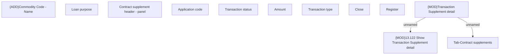

# Transaction Supplement detail

- **Diagram Type**: Custom
- **Package**: HomerSelect/BSL/Analysis Model/Contract Supplements/Transaction Supplement support/User Interface model
- **Diagram ID**: 160819
- **Elements**: 12
- **Connectors**: 2

