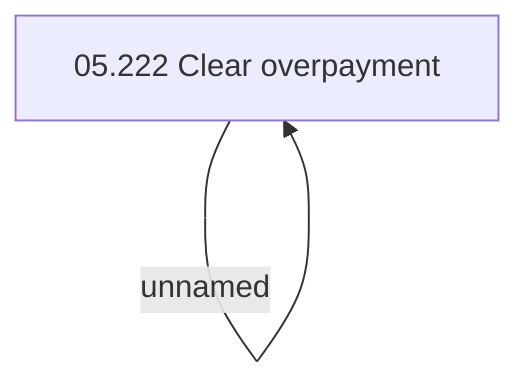

# Access rights

- **Diagram Type**: Custom
- **Package**: HomerSelect/BSL/Analysis Model/Installment Schedule/Clear overpayment/Access rights
- **Diagram ID**: 138634
- **Elements**: 2
- **Connectors**: 1

