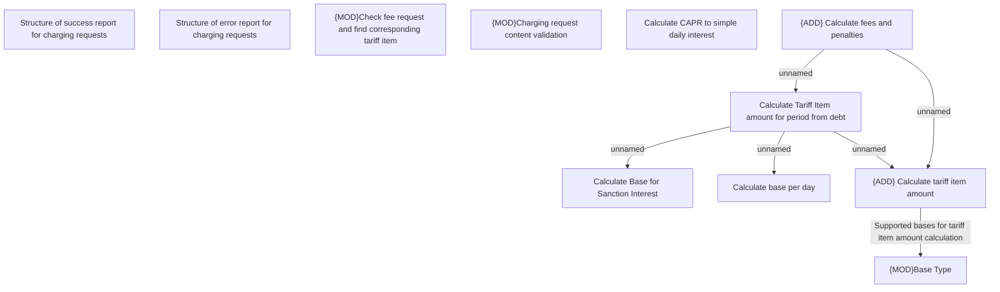

# Business Rules

```mermaid
graph TD
    Structure_of_success_report_for_charging_requests["Structure of success report for charging requests"]
    Structure_of_error_report_for_charging_requests["Structure of error report for charging requests"]
    MOD_Base_Type["{MOD}Base Type"]
    Calculate_Base_for_Sanction_Interest["Calculate Base for Sanction Interest"]
    MOD_Check_fee_request_and_find_corresponding_tariff_item["{MOD}Check fee request and find corresponding tariff item"]
    MOD_Charging_request_content_validation["{MOD}Charging request content validation"]
    Calculate_CAPR_to_simple_daily_interest["Calculate CAPR to simple daily interest"]
    Calculate_base_per_day["Calculate base per day"]
    Calculate_Tariff_Item_amount_for_period_from_debt["Calculate Tariff Item amount for period from debt"]
    ADD_Calculate_tariff_item_amount["{ADD} Calculate tariff item amount"]
    ADD_Calculate_fees_and_penalties["{ADD} Calculate fees and penalties"]
    Calculate_Tariff_Item_amount_for_period_from_debt -->|unnamed| ADD_Calculate_tariff_item_amount
    ADD_Calculate_fees_and_penalties -->|unnamed| ADD_Calculate_tariff_item_amount
    ADD_Calculate_fees_and_penalties -->|unnamed| Calculate_Tariff_Item_amount_for_period_from_debt
    Calculate_Tariff_Item_amount_for_period_from_debt -->|unnamed| Calculate_base_per_day
    Calculate_Tariff_Item_amount_for_period_from_debt -->|unnamed| Calculate_Base_for_Sanction_Interest
    ADD_Calculate_tariff_item_amount -->|Supported bases for tariff item amount calculation| MOD_Base_Type
```
