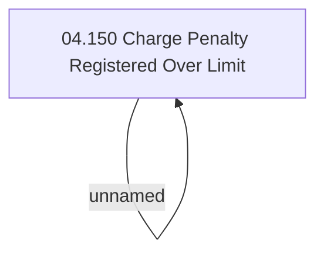

# Access Rights

- **Diagram Type**: Custom
- **Package**: HomerSelect/BSL/Analysis Model/Installment Schedule/Fees and Penalties/Penalty Limit/Access Rights
- **Diagram ID**: 159978
- **Elements**: 2
- **Connectors**: 1

