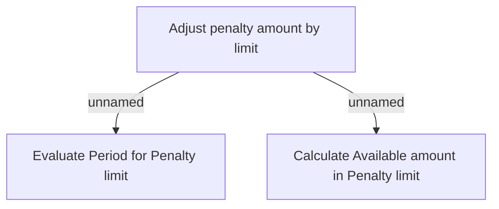

# Business Rules

- **Diagram Type**: Custom
- **Package**: HomerSelect/BSL/Analysis Model/Installment Schedule/Fees and Penalties/Penalty Limit/Business Rules
- **Diagram ID**: 159979
- **Elements**: 3
- **Connectors**: 2

