# Access Rights

- **Diagram Type**: Custom
- **Package**: HomerSelect/BSL/Analysis Model/Installment Schedule/Installment Schedule/Access Rights
- **Diagram ID**: 153378
- **Elements**: 26
- **Connectors**: 16

```mermaid
graph TD
    n_03_020_Show_installment_schedule_overrule["03.020 Show installment schedule (overrule)"]
    ADD_03_011_Generate_daily_transaction_messages_for_BOOK_NG["{ADD}03.011 Generate daily transaction messages for BOOK NG"]
    ADD_03_011_Generate_daily_transaction_messages_for_BOOK_NG["{ADD}03.011 Generate daily transaction messages for BOOK NG"]
    ADD_03_180_Get_Installment_Schedule_Print_Data["{ADD}03.180 Get Installment Schedule Print Data"]
    ADD_03_037_Deduct_interest_overcharge_while_shortening_first["{ADD}03.037 Deduct interest overcharge while shortening first interest period"]
    MOD_03_037_Deduct_interest_overcharge_while_shortening_first["{MOD}03.037 Deduct interest overcharge while shortening first interest period"]
    n_03_042_Generate_IS_printout_bulk["03.042 Generate IS printout - bulk"]
    n_03_042_Process_IS_printouts_generating_in_bulk["03.042 Process IS printouts generating in bulk"]
    n_03_045_Generate_IS_printout["03.045 Generate IS printout"]
    n_03_045_Generate_IS_printout["03.045 Generate IS printout"]
    n_03_040_Print_selected_version_of_IS["03.040 Print selected version of IS"]
    n_03_040_Print_selected_version_of_IS["03.040 Print selected version of IS"]
    n_03_095_Remove_installment["03.095 Remove installment"]
    n_03_090_Remove_installment_manually["03.090 Remove installment manually"]
    n_03_095_Remove_installment["03.095 Remove installment "]
    n_03_090_Remove_installment_manually["03.090 Remove installment manually"]
    n_03_030_Regenerate_installment_schedule["03.030 Regenerate installment schedule"]
    n_03_030_Regenerate_installment_schedule["03.030 Regenerate installment schedule"]
    n_03_080_Add_installment["03.080 Add installment"]
    MOD_03_080_Add_installment["{MOD}03.080 Add installment"]
    n_03_010_Generate_installment_schedule["03.010 Generate installment schedule"]
    n_03_010_Generate_installment_schedule["03.010 Generate installment schedule"]
    n_03_020_Show_installment_schedule_CC_panel["03.020 Show installment schedule (CC panel)"]
    n_03_020_Show_installment_schedule_BO_panel["03.020 Show installment schedule (BO panel)"]
    n_03_020_Show_installment_schedule["03.020 Show installment schedule"]
    n_03_020_Show_installment_schedule["03.020 Show installment schedule"]
    n_03_030_Regenerate_installment_schedule -->|unnamed| n_03_030_Regenerate_installment_schedule
    n_03_040_Print_selected_version_of_IS -->|unnamed| n_03_040_Print_selected_version_of_IS
    n_03_040_Print_selected_version_of_IS -->|unnamed| n_03_045_Generate_IS_printout
    ADD_03_011_Generate_daily_transaction_messages_for_BOOK_NG -->|unnamed| ADD_03_011_Generate_daily_transaction_messages_for_BOOK_NG
    n_03_042_Process_IS_printouts_generating_in_bulk -->|unnamed| n_03_045_Generate_IS_printout
    n_03_042_Process_IS_printouts_generating_in_bulk -->|unnamed| n_03_042_Generate_IS_printout_bulk
    n_03_010_Generate_installment_schedule -->|unnamed| n_03_010_Generate_installment_schedule
    n_03_095_Remove_installment -->|unnamed| n_03_095_Remove_installment
    n_03_045_Generate_IS_printout -->|unnamed| n_03_045_Generate_IS_printout
    MOD_03_037_Deduct_interest_overcharge_while_shortening_first -->|unnamed| ADD_03_037_Deduct_interest_overcharge_while_shortening_first
    MOD_03_080_Add_installment -->|unnamed| n_03_080_Add_installment
    n_03_090_Remove_installment_manually -->|unnamed| n_03_090_Remove_installment_manually
    n_03_020_Show_installment_schedule -->|unnamed| n_03_020_Show_installment_schedule_overrule
    n_03_020_Show_installment_schedule -->|unnamed| n_03_020_Show_installment_schedule_BO_panel
    n_03_020_Show_installment_schedule -->|unnamed| n_03_020_Show_installment_schedule
    n_03_020_Show_installment_schedule -->|unnamed| n_03_020_Show_installment_schedule_CC_panel
```

