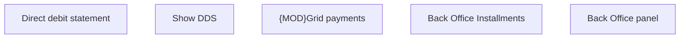

# Back Office panel

- **Diagram Type**: Custom
- **Package**: HomerSelect/BSL/Analysis Model/Installment Schedule/Installment Schedule/User Interface Model
- **Diagram ID**: 162134
- **Elements**: 5
- **Connectors**: 0

