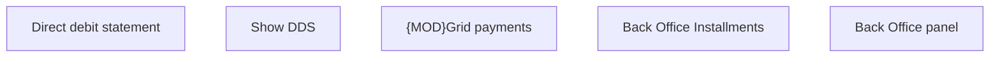

# Back Office panel

```mermaid
graph TD
    Direct_debit_statement["Direct debit statement"]
    Show_DDS["Show DDS"]
    MOD_Grid_payments["{MOD}Grid payments"]
    Back_Office_Installments["Back Office Installments"]
    Back_Office_panel["Back Office panel"]
```
