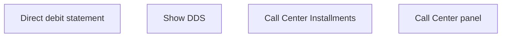

# Call Center panel

- **Diagram Type**: Custom
- **Package**: HomerSelect/BSL/Analysis Model/Installment Schedule/Installment Schedule/User Interface Model
- **Diagram ID**: 162135
- **Elements**: 4
- **Connectors**: 0

