# Installment schedule

- **Diagram Type**: Custom
- **Package**: HomerSelect/BSL/Analysis Model/Installment Schedule/Installment Schedule/User Interface Model
- **Diagram ID**: 162136
- **Elements**: 32
- **Connectors**: 1

```mermaid
graph TD
    Payments["Payments"]
    Browse_incoming_payments_Incoming_payments_search_criteria_S["Browse incoming payments : Incoming payments search criteria - Standard"]
    Next_installment_amount_with_prepayments["Next installment amount with prepayments"]
    Next_installment_due_date_with_prepayments["Next installment due date with prepayments"]
    Debt_catalogue["Debt catalogue"]
    Current_payment_channel["Current payment channel"]
    Installments_without_advance_EMI["Installments without advance EMI"]
    Fully_paid_installments_all_installments["Fully paid installments/all installments"]
    Compact_view["Compact view"]
    Recalculation_date["Recalculation date"]
    Recalculation_reason["Recalculation reason"]
    Print_IS["Print IS"]
    Back["Back"]
    List_of_communication["List of communication"]
    Call_Center_panel["Call Center panel"]
    Back_Office_panel["Back Office panel"]
    n_["››"]
    n_["›"]
    n_["‹"]
    n_["‹‹"]
    Installment_schedule_buttons["Installment schedule buttons"]
    DPD_tolerance["DPD tolerance"]
    Current_DPD_without_with_tolerance["Current DPD without/with tolerance"]
    Total_deliquent_amount["Total deliquent amount"]
    Currency["Currency"]
    Current_date["Current date"]
    Contract["Contract"]
    Client["Client"]
    Installment_schedule_panel["Installment schedule panel"]
    Installment_schedule_form["Installment schedule form"]
    Installments["Installments"]
    Installment_schedule["Installment schedule"]
    Payments -->|unnamed| Browse_incoming_payments_Incoming_payments_search_criteria_S
```

