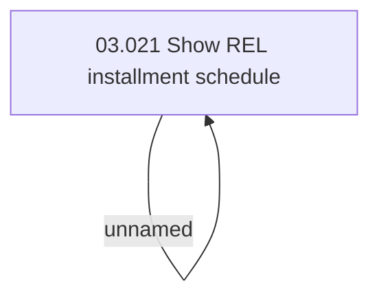

# Access Rights

- **Diagram Type**: Custom
- **Package**: HomerSelect/BSL/Analysis Model/Installment Schedule/REL Installment Schedule/Access Rights
- **Diagram ID**: 62749
- **Elements**: 2
- **Connectors**: 1

