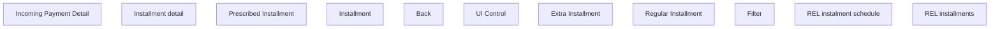

# REL Installment schedule

```mermaid
graph TD
    Incoming_Payment_Detail["Incoming Payment Detail"]
    Installment_detail["Installment detail"]
    Prescribed_Installment["Prescribed Installment"]
    Installment["Installment"]
    Back["Back"]
    UI_Control["UI Control"]
    Extra_Installment["Extra Installment"]
    Regular_Installment["Regular Installment"]
    Filter["Filter"]
    REL_instalment_schedule["REL instalment schedule"]
    REL_installments["REL installments"]
```
