# Service timeline

- **Diagram Type**: Custom
- **Package**: HomerSelect/BSL/Analysis Model/Installment Schedule/Service timeline/User interface model
- **Diagram ID**: 137437
- **Elements**: 20
- **Connectors**: 3

```mermaid
graph TD
    n_03_020_Show_installment_schedule["03.020 Show installment schedule"]
    n_03_301_Rollback_service["03.301 Rollback service"]
    n_03_300_Show_service_timeline["03.300 Show service timeline"]
    Installment_schedule_view["Installment schedule view"]
    Service_timeline_records["Service timeline records"]
    Installments_interest_rate["Installments interest rate"]
    Total_payment_per_credit["Total payment per credit"]
    Presented_interest_rate["Presented interest rate"]
    Number_of_installments["Number of installments"]
    Creadit_amount["Creadit amount"]
    Annual_interest_rate["Annual interest rate"]
    Monthly_installment["Monthly installment"]
    Annuity["Annuity"]
    Financial_parameters["Financial parameters"]
    Installment_schedule["Installment schedule"]
    Panel_of_buttons["Panel of buttons"]
    Contract_status["Contract status"]
    Contract_code["Contract code"]
    Contract_info["Contract info"]
    Service_timeline["Service timeline"]
    Installment_schedule -->|unnamed| n_03_020_Show_installment_schedule
    Service_timeline_records -->|unnamed| n_03_301_Rollback_service
    Service_timeline_records -->|unnamed| n_03_300_Show_service_timeline
```

