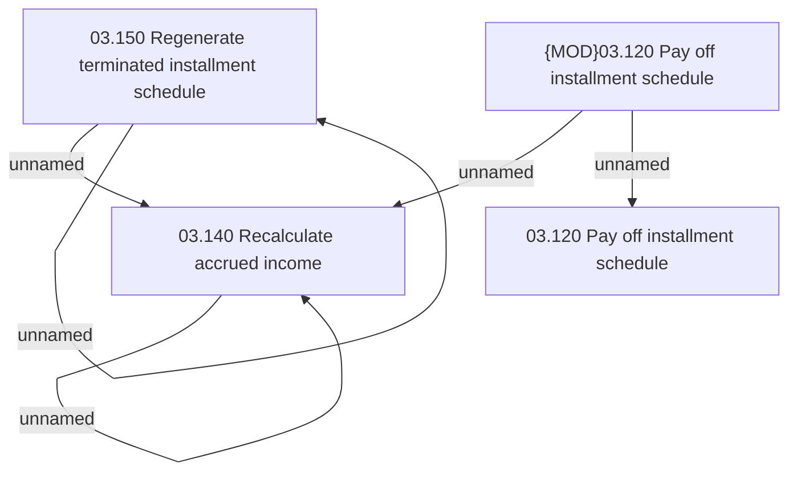

# Access Rights

```mermaid
graph TD
    n_03_150_Regenerate_terminated_installment_schedule["03.150 Regenerate terminated installment schedule"]
    n_03_150_Regenerate_terminated_installment_schedule["03.150 Regenerate terminated installment schedule"]
    n_03_140_Recalculate_accrued_income["03.140 Recalculate accrued income"]
    n_03_140_Recalculate_accrued_income["03.140 Recalculate accrued income"]
    MOD_03_120_Pay_off_installment_schedule["{MOD}03.120 Pay off installment schedule"]
    n_03_120_Pay_off_installment_schedule["03.120 Pay off installment schedule"]
    n_03_150_Regenerate_terminated_installment_schedule -->|unnamed| n_03_140_Recalculate_accrued_income
    MOD_03_120_Pay_off_installment_schedule -->|unnamed| n_03_140_Recalculate_accrued_income
    n_03_140_Recalculate_accrued_income -->|unnamed| n_03_140_Recalculate_accrued_income
    MOD_03_120_Pay_off_installment_schedule -->|unnamed| n_03_120_Pay_off_installment_schedule
    n_03_150_Regenerate_terminated_installment_schedule -->|unnamed| n_03_150_Regenerate_terminated_installment_schedule
```
