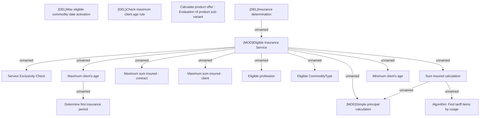

# Eligible Insurance Service

```mermaid
graph TD
    MOD_Eligible_Insurance_Service["{MOD}Eligible Insurance Service"]
    DEL_Max_eligible_commodity_date_activation["{DEL}Max eligible commodity date activation"]
    DEL_Check_maximum_client_age_rule["{DEL}Check maximum client age rule"]
    MOD_Simple_principal_calculation["{MOD}Simple principal calculation"]
    Algorithm_Find_tariff_items_by_usage["Algorithm: Find tariff items by usage"]
    Service_Exclusivity_Check["Service Exclusivity Check"]
    Sum_Insured_calculation["Sum Insured calculation"]
    Maximum_sum_insured_contract["Maximum sum insured - contract"]
    Maximum_sum_insured_client["Maximum sum insured - client"]
    Eligible_profession["Eligible profession"]
    Eligible_CommodityType["Eligible CommodityType"]
    Determine_first_insurance_period["Determine first insurance period"]
    Maximum_client_s_age["Maximum client's age"]
    Minimum_client_s_age["Minimum client's age"]
    Calculate_product_offer_Evaluation_of_product_sub_variant["Calculate product offer : Evaluation of product sub-variant"]
    DEL_Insurance_determination["{DEL}Insurance determination"]
    MOD_Eligible_Insurance_Service -->|unnamed| Minimum_client_s_age
    MOD_Eligible_Insurance_Service -->|unnamed| Maximum_client_s_age
    Maximum_client_s_age -->|unnamed| Determine_first_insurance_period
    MOD_Eligible_Insurance_Service -->|unnamed| Eligible_CommodityType
    MOD_Eligible_Insurance_Service -->|unnamed| Eligible_profession
    MOD_Eligible_Insurance_Service -->|unnamed| Maximum_sum_insured_client
    MOD_Eligible_Insurance_Service -->|unnamed| Maximum_sum_insured_contract
    MOD_Eligible_Insurance_Service -->|unnamed| Sum_Insured_calculation
    MOD_Eligible_Insurance_Service -->|unnamed| Service_Exclusivity_Check
    MOD_Eligible_Insurance_Service -->|unnamed| MOD_Simple_principal_calculation
    Sum_Insured_calculation -->|unnamed| MOD_Simple_principal_calculation
    Sum_Insured_calculation -->|unnamed| Algorithm_Find_tariff_items_by_usage
    DEL_Insurance_determination -->|unnamed| MOD_Eligible_Insurance_Service
```
