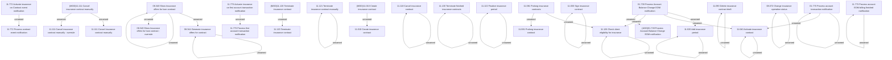

# Access Rights

```mermaid
graph TD
    n_08_340_Show_Insurance_offers_for_loan_contract_overrule["08.340 Show Insurance offers for loan contract - overrule"]
    ADD_01_739_Process_Account_Balance_Change_EOM_notification["{ADD}01.739 Process Account Balance Change EOM notification"]
    n_01_739_Process_Account_Balance_Change_EOM_notification["01.739 Process Account Balance Change EOM notification"]
    n_11_111_Cancel_insurance_contract_manually_overrule["11.111 Cancel insurance contract manually - overrule"]
    n_08_344_Generate_insurance_offers_for_contract["08.344 Generate insurance offers for contract"]
    n_08_344_Generate_insurance_offers_for_contract["08.344 Generate insurance offers for contract"]
    n_08_340_Show_Insurance_offers_for_loan_contract["08.340 Show Insurance offers for loan contract"]
    n_08_072_Change_insurance_operation_status["08.072 Change insurance operation status"]
    n_08_340_Show_Insurance_offers_for_loan_contract["08.340 Show Insurance offers for loan contract"]
    n_11_772_Process_contract_event_notification["11.772 Process contract event notification"]
    n_11_126_Check_client_eligibility_for_insurance["11.126 Check client eligibility for insurance"]
    n_11_773_Process_account_EOM_billing_finished_notification["11.773 Process account EOM billing finished notification"]
    n_11_122_Finalize_insurance_period["11.122 Finalize insurance period"]
    n_11_773_Process_account_EOM_billing_finished_notification["11.773 Process account EOM billing finished notification"]
    n_11_772_Activate_insurance_on_Contract_event_notification["11.772 Activate insurance on Contract event notification"]
    n_11_126_Check_client_eligibility_for_insurance["11.126 Check client eligibility for insurance"]
    n_11_122_Finalize_insurance_period["11.122 Finalize insurance period"]
    n_11_770_Activate_insurance_on_first_account_transaction_not["11.770 Activate insurance on first account transaction notification"]
    n_11_770_Process_first_account_transaction_notification["11.770 Process first account transaction notification"]
    n_01_770_Process_account_transaction_notification["01.770 Process account transaction notification"]
    n_01_770_Process_account_transaction_notification["01.770 Process account transaction notification"]
    n_11_121_Terminate_insurance_contract_manually["11.121 Terminate insurance contract manually"]
    n_11_121_Terminate_insurance_contract_manually["11.121 Terminate insurance contract manually"]
    n_11_111_Cancel_insurance_contract_manually["11.111 Cancel insurance contract manually"]
    MOD_11_111_Cancel_insurance_contract_manually["{MOD}11.111 Cancel insurance contract manually"]
    n_11_081_Prolong_insurance_contract["11.081 Prolong insurance contract"]
    n_11_081_Prolong_insurance_contracts["11.081 Prolong insurance contracts"]
    n_11_090_Delete_insurance_contract_draft["11.090 Delete insurance contract draft"]
    n_11_090_Delete_insurance_contract_draft["11.090 Delete insurance contract draft"]
    n_11_130_Terminate_finished_insurance_contracts["11.130 Terminate finished insurance contracts"]
    n_11_130_Terminate_finished_insurance_contracts["11.130 Terminate finished insurance contracts"]
    n_11_120_Terminate_insurance_contract["11.120 Terminate insurance contract"]
    n_11_110_Cancel_insurance_contract["11.110 Cancel insurance contract"]
    n_11_040_Activate_insurance_contract["11.040 Activate insurance contract"]
    n_11_030_Sign_insurance_contract["11.030 Sign insurance contract"]
    n_11_020_Add_insurance_period["11.020 Add insurance period"]
    n_11_010_Create_insurance_contract["11.010 Create insurance contract"]
    MOD_11_120_Terminate_insurance_contract["{MOD}11.120 Terminate insurance contract"]
    n_11_110_Cancel_insurance_contract["11.110 Cancel insurance contract"]
    n_11_040_Activate_insurance_contract["11.040 Activate insurance contract"]
    n_11_020_Add_insurance_period["11.020 Add insurance period"]
    MOD_11_010_Create_insurance_contract["{MOD}11.010 Create insurance contract"]
    n_11_030_Sign_insurance_contract["11.030 Sign insurance contract"]
    n_08_072_Change_insurance_operation_status["08.072 Change insurance operation status"]
    n_08_340_Show_Insurance_offers_for_loan_contract -->|unnamed| n_08_344_Generate_insurance_offers_for_contract
    n_08_340_Show_Insurance_offers_for_loan_contract -->|unnamed| n_08_340_Show_Insurance_offers_for_loan_contract
    n_08_340_Show_Insurance_offers_for_loan_contract -->|unnamed| n_08_340_Show_Insurance_offers_for_loan_contract_overrule
    n_08_344_Generate_insurance_offers_for_contract -->|unnamed| n_08_344_Generate_insurance_offers_for_contract
    n_11_121_Terminate_insurance_contract_manually -->|unnamed| n_11_121_Terminate_insurance_contract_manually
    n_11_110_Cancel_insurance_contract -->|unnamed| n_11_110_Cancel_insurance_contract
    n_11_130_Terminate_finished_insurance_contracts -->|unnamed| n_11_130_Terminate_finished_insurance_contracts
    MOD_11_120_Terminate_insurance_contract -->|unnamed| n_11_120_Terminate_insurance_contract
    MOD_11_111_Cancel_insurance_contract_manually -->|unnamed| n_11_111_Cancel_insurance_contract_manually
    MOD_11_111_Cancel_insurance_contract_manually -->|unnamed| n_11_111_Cancel_insurance_contract_manually_overrule
    n_11_122_Finalize_insurance_period -->|unnamed| n_11_122_Finalize_insurance_period
    n_11_020_Add_insurance_period -->|unnamed| n_11_020_Add_insurance_period
    n_11_030_Sign_insurance_contract -->|unnamed| n_11_030_Sign_insurance_contract
    MOD_11_010_Create_insurance_contract -->|unnamed| n_11_010_Create_insurance_contract
    n_11_772_Activate_insurance_on_Contract_event_notification -->|unnamed| n_11_772_Process_contract_event_notification
    n_11_081_Prolong_insurance_contracts -->|unnamed| n_11_126_Check_client_eligibility_for_insurance
    n_11_126_Check_client_eligibility_for_insurance -->|unnamed| n_11_126_Check_client_eligibility_for_insurance
    n_11_040_Activate_insurance_contract -->|unnamed| n_11_040_Activate_insurance_contract
    n_11_081_Prolong_insurance_contracts -->|unnamed| n_11_081_Prolong_insurance_contract
    n_11_090_Delete_insurance_contract_draft -->|unnamed| n_11_090_Delete_insurance_contract_draft
    n_01_739_Process_Account_Balance_Change_EOM_notification -->|unnamed| n_11_020_Add_insurance_period
    n_08_072_Change_insurance_operation_status -->|unnamed| n_08_072_Change_insurance_operation_status
    n_01_770_Process_account_transaction_notification -->|unnamed| n_01_770_Process_account_transaction_notification
    n_01_739_Process_Account_Balance_Change_EOM_notification -->|unnamed| n_11_040_Activate_insurance_contract
    n_01_739_Process_Account_Balance_Change_EOM_notification -->|unnamed| n_11_126_Check_client_eligibility_for_insurance
    n_01_739_Process_Account_Balance_Change_EOM_notification -->|unnamed| ADD_01_739_Process_Account_Balance_Change_EOM_notification
    n_11_773_Process_account_EOM_billing_finished_notification -->|unnamed| n_11_773_Process_account_EOM_billing_finished_notification
    n_01_770_Process_account_transaction_notification -->|unnamed| n_11_040_Activate_insurance_contract
    n_11_770_Activate_insurance_on_first_account_transaction_not -->|unnamed| n_11_770_Process_first_account_transaction_notification
```
