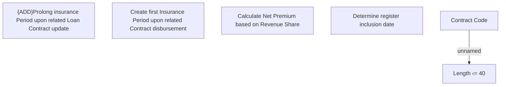

# Insurance contract

```mermaid
graph TD
    ADD_Prolong_insurance_Period_upon_related_Loan_Contract_upda["{ADD}Prolong insurance Period upon related Loan Contract update"]
    Create_first_Insurance_Period_upon_related_Contract_disburse["Create first Insurance Period upon related Contract disbursement"]
    Calculate_Net_Premium_based_on_Revenue_Share["Calculate Net Premium based on Revenue Share"]
    Determine_register_inclusion_date["Determine register inclusion date"]
    Length_40["Length ‹= 40"]
    Contract_Code["Contract Code"]
    Contract_Code -->|unnamed| Length_40
```
