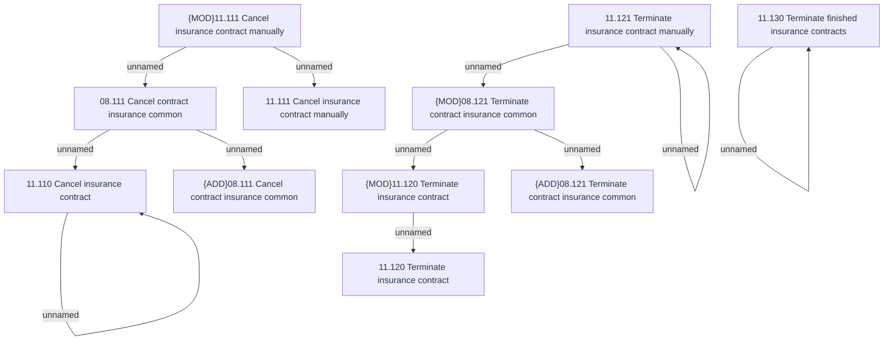

# Access Rights

- **Diagram Type**: Custom
- **Package**: HomerSelect/BSL/Analysis Model/Insurance/Insurance Contract/Insurance finishing/Access Rights
- **Diagram ID**: 147846
- **Elements**: 14
- **Connectors**: 11

