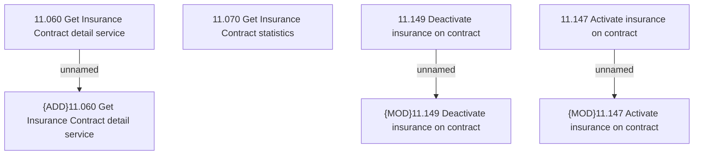

# Access Rights

- **Diagram Type**: Custom
- **Package**: HomerSelect/BSL/Analysis Model/Insurance/Insurance Contract/REL Insurance features/Changing Insurance operation status/Access Rights
- **Diagram ID**: 162069
- **Elements**: 7
- **Connectors**: 3

