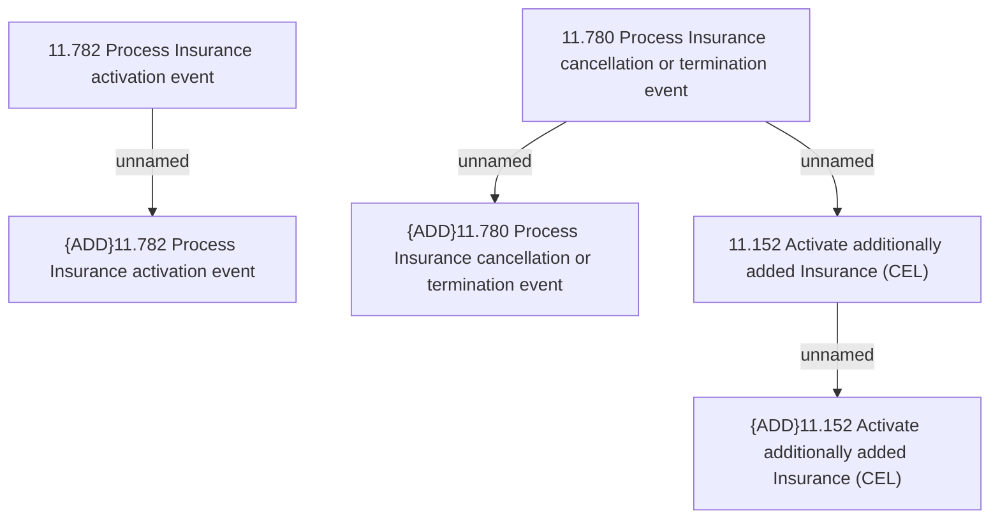

# Access Rights

```mermaid
graph TD
    ADD_11_782_Process_Insurance_activation_event["{ADD}11.782 Process Insurance activation event"]
    n_11_782_Process_Insurance_activation_event["11.782 Process Insurance activation event"]
    ADD_11_780_Process_Insurance_cancellation_or_termination_eve["{ADD}11.780 Process Insurance cancellation or termination event"]
    ADD_11_152_Activate_additionally_added_Insurance_CEL["{ADD}11.152 Activate additionally added Insurance (CEL)"]
    n_11_780_Process_Insurance_cancellation_or_termination_event["11.780 Process Insurance cancellation or termination event"]
    n_11_152_Activate_additionally_added_Insurance_CEL["11.152 Activate additionally added Insurance (CEL)"]
    n_11_780_Process_Insurance_cancellation_or_termination_event -->|unnamed| n_11_152_Activate_additionally_added_Insurance_CEL
    n_11_780_Process_Insurance_cancellation_or_termination_event -->|unnamed| ADD_11_780_Process_Insurance_cancellation_or_termination_eve
    n_11_782_Process_Insurance_activation_event -->|unnamed| ADD_11_782_Process_Insurance_activation_event
    n_11_152_Activate_additionally_added_Insurance_CEL -->|unnamed| ADD_11_152_Activate_additionally_added_Insurance_CEL
```
