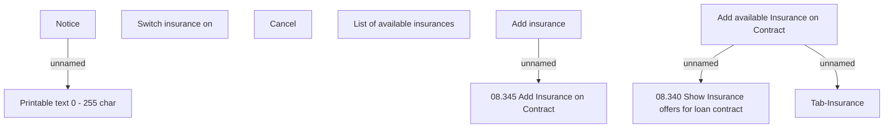

# Add available Insurance on Contract

- **Diagram Type**: Custom
- **Package**: HomerSelect/BSL/Analysis Model/Insurance/Insurance Contract/User Interface Model
- **Diagram ID**: 153463
- **Elements**: 10
- **Connectors**: 4

