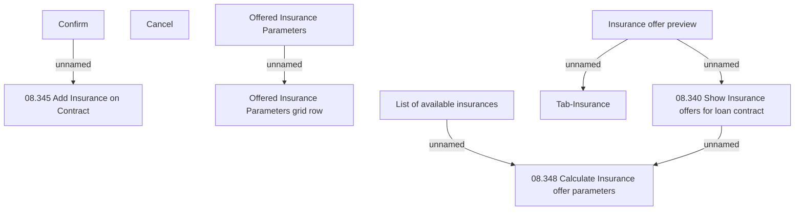

# Insurance Offer Preview

```mermaid
graph TD
    n_08_345_Add_Insurance_on_Contract["08.345 Add Insurance on Contract"]
    Offered_Insurance_Parameters_grid_row["Offered Insurance Parameters grid row"]
    n_08_340_Show_Insurance_offers_for_loan_contract["08.340 Show Insurance offers for loan contract"]
    n_08_348_Calculate_Insurance_offer_parameters["08.348 Calculate Insurance offer parameters"]
    Tab_Insurance["Tab-Insurance"]
    Confirm["Confirm"]
    Cancel["Cancel"]
    Offered_Insurance_Parameters["Offered Insurance Parameters"]
    List_of_available_insurances["List of available insurances"]
    Insurance_offer_preview["Insurance offer preview"]
    Confirm -->|unnamed| n_08_345_Add_Insurance_on_Contract
    Insurance_offer_preview -->|unnamed| Tab_Insurance
    List_of_available_insurances -->|unnamed| n_08_348_Calculate_Insurance_offer_parameters
    Insurance_offer_preview -->|unnamed| n_08_340_Show_Insurance_offers_for_loan_contract
    Offered_Insurance_Parameters -->|unnamed| Offered_Insurance_Parameters_grid_row
    n_08_340_Show_Insurance_offers_for_loan_contract -->|unnamed| n_08_348_Calculate_Insurance_offer_parameters
```
