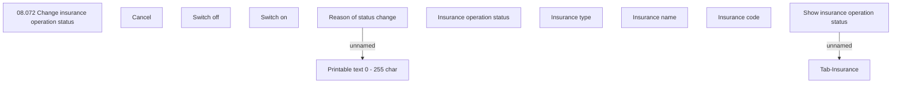

# Show insurance operation status

- **Diagram Type**: Custom
- **Package**: HomerSelect/BSL/Analysis Model/Insurance/Insurance Contract/User Interface Model
- **Diagram ID**: 153464
- **Elements**: 12
- **Connectors**: 2

