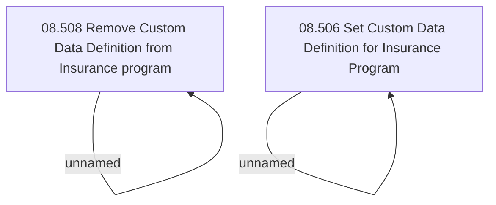

# Access Rights

```mermaid
graph TD
    n_08_508_Remove_Custom_Data_Definition_from_Insurance_progra["08.508 Remove Custom Data Definition from Insurance program"]
    n_08_508_Remove_Custom_Data_Definition_from_Insurance_progra["08.508 Remove Custom Data Definition from Insurance program"]
    n_08_506_Set_Custom_Data_Definition_for_Insurance_Program["08.506 Set Custom Data Definition for Insurance Program"]
    n_08_506_Set_Custom_Data_Definition_for_Insurance_Program["08.506 Set Custom Data Definition for Insurance Program"]
    n_08_508_Remove_Custom_Data_Definition_from_Insurance_progra -->|unnamed| n_08_508_Remove_Custom_Data_Definition_from_Insurance_progra
    n_08_506_Set_Custom_Data_Definition_for_Insurance_Program -->|unnamed| n_08_506_Set_Custom_Data_Definition_for_Insurance_Program
```
