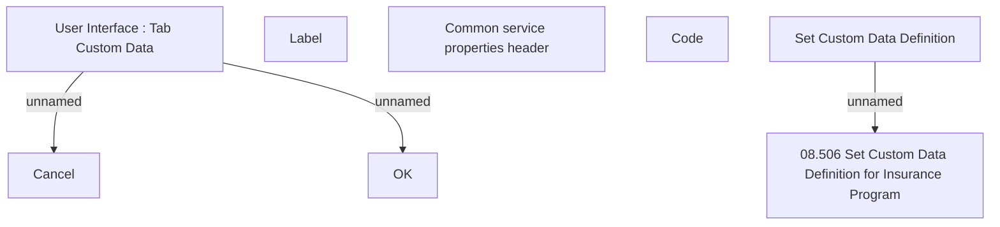

# Custom Data - Set

```mermaid
graph TD
    User_Interface_Tab_Custom_Data["User Interface : Tab Custom Data"]
    n_08_506_Set_Custom_Data_Definition_for_Insurance_Program["08.506 Set Custom Data Definition for Insurance Program"]
    Label["Label"]
    Common_service_properties_header["Common service properties header"]
    OK["OK"]
    Cancel["Cancel"]
    Code["Code"]
    Set_Custom_Data_Definition["Set Custom Data Definition"]
    User_Interface_Tab_Custom_Data -->|unnamed| Cancel
    User_Interface_Tab_Custom_Data -->|unnamed| OK
    Set_Custom_Data_Definition -->|unnamed| n_08_506_Set_Custom_Data_Definition_for_Insurance_Program
```
