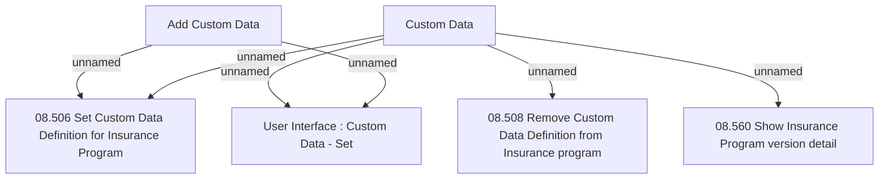

# Tab Custom Data

- **Diagram Type**: Custom
- **Package**: HomerSelect/BSL/Analysis Model/Insurance/Insurance Program - old BSL/Custom Data/User Interface
- **Diagram ID**: 69517
- **Elements**: 7
- **Connectors**: 6

