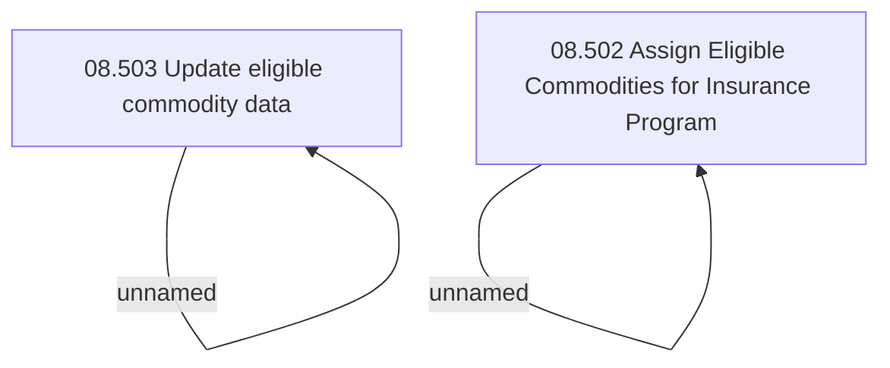

# Access Rights

- **Diagram Type**: Custom
- **Package**: HomerSelect/BSL/Analysis Model/Insurance/Insurance Program - old BSL/Eligible Commodities/Access Rights
- **Diagram ID**: 125700
- **Elements**: 4
- **Connectors**: 2

