# Eligible Commodities - Set additional data

- **Diagram Type**: Custom
- **Package**: HomerSelect/BSL/Analysis Model/Insurance/Insurance Program - old BSL/Eligible Commodities/User Interface
- **Diagram ID**: 125439
- **Elements**: 12
- **Connectors**: 6

```mermaid
graph TD
    Number_0_up_to_999999999_positive_integer["Number 0 up to 999999999 (positive integer)"]
    ADD_Minimal_price["{ADD}Minimal price"]
    Update_Eligible_Commodity_data_validation_rules["Update Eligible Commodity data validation rules"]
    n_08_503_Update_eligible_commodity_data["08.503 Update eligible commodity data"]
    Tab_Eligible_Commodities["Tab Eligible Commodities"]
    Number_0_up_to_999_Positive_integer_only["Number 0 up to 999 (Positive integer only)"]
    Max_days_after_activation["Max days after activation"]
    Cancel["Cancel"]
    Update["Update"]
    Commodity_type["Commodity type"]
    Commodity_category["Commodity category"]
    Update_Eligible_Commodity_data["Update Eligible Commodity data"]
    Update_Eligible_Commodity_data_validation_rules -->|unnamed| Number_0_up_to_999_Positive_integer_only
    Max_days_after_activation -->|unnamed| Number_0_up_to_999_Positive_integer_only
    Update_Eligible_Commodity_data -->|unnamed| Tab_Eligible_Commodities
    Update_Eligible_Commodity_data -->|unnamed| n_08_503_Update_eligible_commodity_data
    ADD_Minimal_price -->|unnamed| Number_0_up_to_999999999_positive_integer
    Update_Eligible_Commodity_data_validation_rules -->|unnamed| Number_0_up_to_999999999_positive_integer
```

