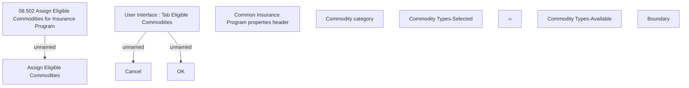

# Eligible commodities - Assign

```mermaid
graph TD
    n_08_502_Assign_Eligible_Commodities_for_Insurance_Program["08.502 Assign Eligible Commodities for Insurance Program"]
    User_Interface_Tab_Eligible_Commodities["User Interface : Tab Eligible Commodities"]
    Common_Insurance_Program_properties_header["Common Insurance Program properties header"]
    Commodity_category["Commodity category"]
    Commodity_Types_Selected["Commodity Types-Selected"]
    n_["‹‹"]
    n_["››"]
    Commodity_Types_Available["Commodity Types-Available"]
    OK["OK"]
    Cancel["Cancel"]
    el_1499814["Boundary"]
    Assign_Eligible_Commodities["Assign Eligible Commodities"]
    n_08_502_Assign_Eligible_Commodities_for_Insurance_Program -->|unnamed| Assign_Eligible_Commodities
    User_Interface_Tab_Eligible_Commodities -->|unnamed| Cancel
    User_Interface_Tab_Eligible_Commodities -->|unnamed| OK
```
