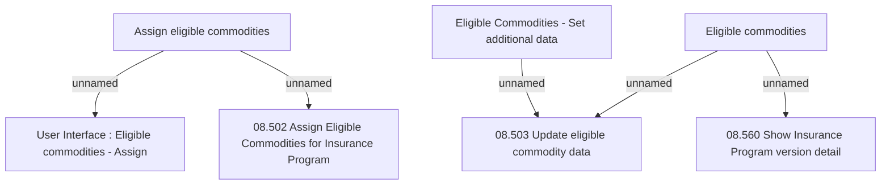

# Tab Eligible Commodities

- **Diagram Type**: Custom
- **Package**: HomerSelect/BSL/Analysis Model/Insurance/Insurance Program - old BSL/Eligible Commodities/User Interface
- **Diagram ID**: 125437
- **Elements**: 8
- **Connectors**: 5

