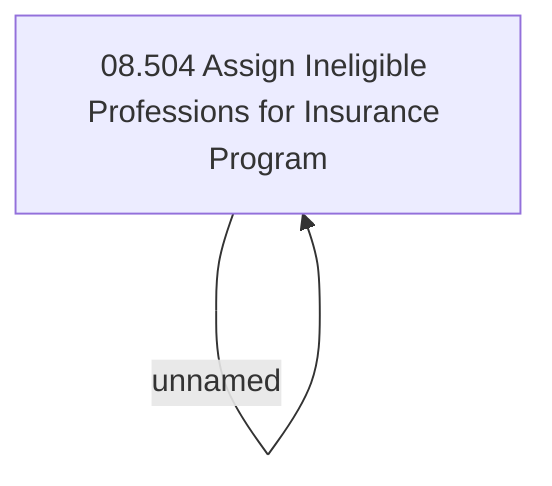

# Access Rights

- **Diagram Type**: Custom
- **Package**: HomerSelect/BSL/Analysis Model/Insurance/Insurance Program - old BSL/Ineligible Professions/Access Rights
- **Diagram ID**: 69511
- **Elements**: 2
- **Connectors**: 1

