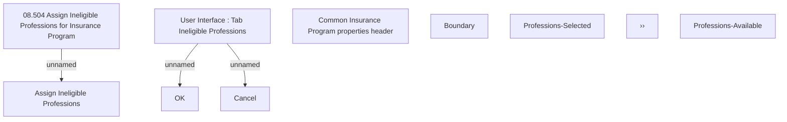

# Ineligible professions - Assign

- **Diagram Type**: Custom
- **Package**: HomerSelect/BSL/Analysis Model/Insurance/Insurance Program - old BSL/Ineligible Professions/User Interface
- **Diagram ID**: 69514
- **Elements**: 11
- **Connectors**: 3

