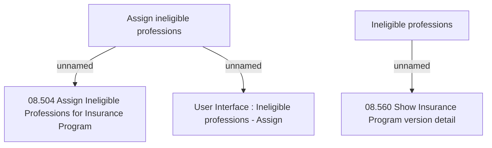

# Tab Ineligible Professions

```mermaid
graph TD
    n_08_560_Show_Insurance_Program_version_detail["08.560 Show Insurance Program version detail"]
    n_08_504_Assign_Ineligible_Professions_for_Insurance_Program["08.504 Assign Ineligible Professions for Insurance Program"]
    User_Interface_Ineligible_professions_Assign["User Interface : Ineligible professions - Assign"]
    Assign_ineligible_professions["Assign ineligible professions"]
    Ineligible_professions["Ineligible professions"]
    Ineligible_professions["Ineligible professions"]
    Assign_ineligible_professions -->|unnamed| n_08_504_Assign_Ineligible_Professions_for_Insurance_Program
    Assign_ineligible_professions -->|unnamed| User_Interface_Ineligible_professions_Assign
    Ineligible_professions -->|unnamed| n_08_560_Show_Insurance_Program_version_detail
```
