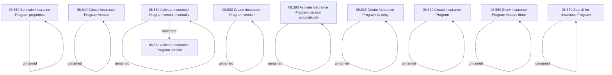

# Access Rights

```mermaid
graph TD
    n_08_550_Set_main_Insurance_Program_properties["08.550 Set main Insurance Program properties"]
    n_08_540_Cancel_Insurance_Program_version["08.540 Cancel Insurance Program version"]
    n_08_530_Create_Insurance_Program_version["08.530 Create Insurance Program version"]
    n_08_580_Activate_Insurance_Program_version_manually["08.580 Activate Insurance Program version manually"]
    n_08_590_Activate_Insurance_Program_version_automatically["08.590 Activate Insurance Program version automatically"]
    n_08_525_Create_Insurance_Program_by_copy["08.525 Create Insurance Program by copy"]
    n_08_520_Create_Insurance_Program["08.520 Create Insurance Program"]
    n_08_560_Show_Insurance_Program_version_detail["08.560 Show Insurance Program version detail"]
    n_08_570_Search_for_Insurance_Program["08.570 Search for Insurance Program"]
    n_08_590_Activate_Insurance_Program_version_automatically["08.590 Activate Insurance Program version automatically"]
    n_08_570_Search_for_Insurance_Program["08.570 Search for Insurance Program"]
    n_08_560_Show_Insurance_Program_version_detail["08.560 Show Insurance Program version detail"]
    n_08_540_Cancel_Insurance_Program_version["08.540 Cancel Insurance Program version"]
    n_08_520_Create_Insurance_Program["08.520 Create Insurance Program"]
    n_08_550_Set_main_Insurance_Program_properties["08.550 Set main Insurance Program properties"]
    n_08_525_Create_Insurance_Program_by_copy["08.525 Create Insurance Program by copy"]
    n_08_530_Create_Insurance_Program_version["08.530 Create Insurance Program version"]
    n_08_580_Activate_Insurance_Program_version_manually["08.580 Activate Insurance Program version manually"]
    n_08_580_Activate_Insurance_Program_version["08.580 Activate Insurance Program version"]
    n_08_530_Create_Insurance_Program_version -->|unnamed| n_08_530_Create_Insurance_Program_version
    n_08_540_Cancel_Insurance_Program_version -->|unnamed| n_08_540_Cancel_Insurance_Program_version
    n_08_570_Search_for_Insurance_Program -->|unnamed| n_08_570_Search_for_Insurance_Program
    n_08_550_Set_main_Insurance_Program_properties -->|unnamed| n_08_550_Set_main_Insurance_Program_properties
    n_08_560_Show_Insurance_Program_version_detail -->|unnamed| n_08_560_Show_Insurance_Program_version_detail
    n_08_580_Activate_Insurance_Program_version_manually -->|unnamed| n_08_580_Activate_Insurance_Program_version_manually
    n_08_580_Activate_Insurance_Program_version_manually -->|unnamed| n_08_580_Activate_Insurance_Program_version
    n_08_520_Create_Insurance_Program -->|unnamed| n_08_520_Create_Insurance_Program
    n_08_590_Activate_Insurance_Program_version_automatically -->|unnamed| n_08_590_Activate_Insurance_Program_version_automatically
    n_08_525_Create_Insurance_Program_by_copy -->|unnamed| n_08_525_Create_Insurance_Program_by_copy
```
