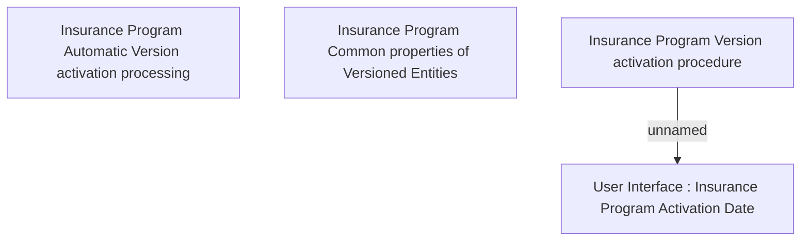

# Business Rules for Insurance Program Versioned Entity

- **Diagram Type**: Custom
- **Package**: HomerSelect/BSL/Analysis Model/Insurance/Insurance Program - old BSL/Insurance program Root/Business Rules
- **Diagram ID**: 125614
- **Elements**: 4
- **Connectors**: 1

