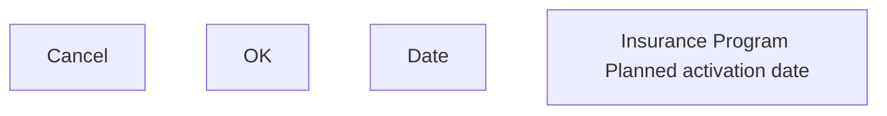

# Insurance Program Activation Date

- **Diagram Type**: Custom
- **Package**: HomerSelect/BSL/Analysis Model/Insurance/Insurance Program - old BSL/Insurance program Root/User Interface
- **Diagram ID**: 127372
- **Elements**: 4
- **Connectors**: 0

