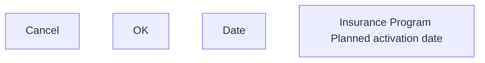

# Insurance Program Activation Date

```mermaid
graph TD
    Cancel["Cancel"]
    OK["OK"]
    Date["Date"]
    Insurance_Program_Planned_activation_date["Insurance Program Planned activation date"]
```
