# Search for Insurance Program

- **Diagram Type**: Custom
- **Package**: HomerSelect/BSL/Analysis Model/Insurance/Insurance Program - old BSL/Insurance program Root/User Interface
- **Diagram ID**: 127376
- **Elements**: 20
- **Connectors**: 6

```mermaid
graph TD
    Salesroom["Salesroom"]
    User_Interface_Show_Insurance_Program["User Interface : Show Insurance Program"]
    n_08_560_Show_Insurance_Program_version_detail["08.560 Show Insurance Program version detail"]
    User_Interface_Create_Insurance_Program["User Interface : Create Insurance Program"]
    n_08_520_Create_Insurance_Program["08.520 Create Insurance Program"]
    Evaluate_Insurance_program_search_criteria["Evaluate Insurance program search criteria"]
    n_08_570_Search_for_Insurance_Program["08.570 Search for Insurance Program"]
    Version_activated_to["Version activated to"]
    Version_activated_from["Version activated from"]
    Version_Status["Version Status"]
    Add_Insurance_program["Add Insurance program"]
    Name["Name"]
    Insurance_Program_valid_on["Insurance Program valid on"]
    Code["Code"]
    Search_results["Search results"]
    Search_for_Insurance_program_criteria["Search for Insurance program criteria"]
    Reset["Reset"]
    Search["Search"]
    Search_buttons["Search buttons"]
    Search_for_Insurance_program["Search for Insurance program"]
    Search_for_Insurance_program -->|unnamed| n_08_570_Search_for_Insurance_Program
    Add_Insurance_program -->|unnamed| n_08_520_Create_Insurance_Program
    User_Interface_Create_Insurance_Program -->|unnamed| n_08_520_Create_Insurance_Program
    Search_results -->|unnamed| n_08_560_Show_Insurance_Program_version_detail
    User_Interface_Show_Insurance_Program -->|unnamed| n_08_560_Show_Insurance_Program_version_detail
    n_08_570_Search_for_Insurance_Program -->|unnamed| Evaluate_Insurance_program_search_criteria
```

