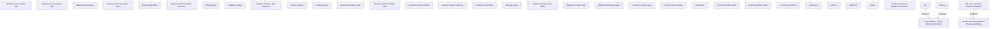

# Set main Insurance Program properties

```mermaid
graph TD
    ADD_Insurance_subject_type["{ADD}Insurance subject type"]
    Maximal_Age_Restriction_Type["Maximal Age Restriction Type"]
    Maximal_Age_Female["Maximal Age Female"]
    Maximal_Sum_Insured_for_Client["Maximal Sum Insured for Client"]
    Maximal_Age_Male["Maximal Age Male"]
    Maximal_Sum_Insured_for_Contract["Maximal Sum Insured for Contract"]
    Minimal_Age["Minimal Age"]
    Eligibility_criteria["Eligibility criteria"]
    Register_inclusion_date_frequency["Register inclusion date frequency"]
    User_Interface_Show_Insurance_Program["User Interface : Show Insurance Program"]
    Version_number["Version number"]
    Version_status["Version status"]
    Insurance_program_code["Insurance program code"]
    Revenue_share_rounding_scale["Revenue share rounding scale"]
    Revenue_share_rounding["Revenue share rounding"]
    Revenue_share_frequency["Revenue share frequency"]
    Revenue_share_base["Revenue share base"]
    Revenue_share["Revenue share"]
    Register_inclusion_date_offset["Register inclusion date offset"]
    Register_inclusion_date["Register inclusion date"]
    DEL_Insured_subject_type["{DEL}Insured subject type"]
    Insurance_contract_type["Insurance contract type"]
    Fixed_contract_number["Fixed contract number"]
    Description["Description"]
    Contract_number_suffix["Contract number suffix"]
    Contract_number_prefix["Contract number prefix"]
    Contract_numbering["Contract numbering"]
    Salesroom["Salesroom"]
    Valid_to["Valid to"]
    Valid_from["Valid from"]
    Name["Name"]
    Common_Insurance_program_information["Common Insurance program information"]
    n_08_550_Set_main_Insurance_Program_properties["08.550 Set main Insurance Program properties"]
    Cancel["Cancel"]
    OK["OK"]
    Set_main_Insurance_program_properties["Set main Insurance program properties"]
    Set_main_Insurance_program_properties -->|unnamed| n_08_550_Set_main_Insurance_Program_properties
    OK -->|unnamed| User_Interface_Show_Insurance_Program
    Cancel -->|unnamed| User_Interface_Show_Insurance_Program
```
